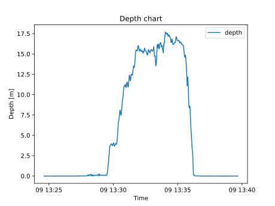

# Plotting
This example shows how one can pull a log file from the drone and use
[pandas](https://pandas.pydata.org/) and [matplotlib](https://matplotlib.org/) to plot
it.

/// tab | Binary logs
We'll start by downloading a log file from the drone

```python
from blueye.sdk import Drone

myDrone = Drone()
log = myDrone.logs[0]
```

Next we'll parse the log to a stream and create a pandas dataframe from the records. We'll also specify the column names to make it easier to work with the dataframe later.

```python
import pandas as pd
import blueye.protocol as bp

columns = ["rt", "delta", "meta", "message"]
log_stream = log.parse_to_stream()
divelog = pd.DataFrame.from_records(log_stream, columns=columns)
```

We'll now filter out all entries that are not depth telemetry messages and messages that were logged before the start of the dive.

```python
depth_log = divelog[divelog.meta == bp.DepthTel]
depth_log = depth_log[depth_log.rt > log.start_time]
```

We can now extract the depth value from the remaining entries

```python
depth_log["depth"] = depth_log["message"].apply(lambda x: x.depth.value)
```

We'll prepare our axes for plotting

```python
x = depth_log["rt"]
y = depth_log["depth"]
```
///
/// tab | Legacy Logs
We'll start by downloading a log file from the drone

```python
from blueye.sdk import Drone

myDrone = Drone()
myDrone.legacy_logs[0].download(output_name="log0.csv")
```

We can now read the csv-file into a pandas object for easy manipulation

```python
import pandas as pd

divelog = pd.read_csv("log0.csv")
```

and then we'll convert the unix timestamp in `rt_clock` into a more readable format:

```python
divelog["rt_clock"] = pandas.to_datetime(divelog["rt_clock"], unit="s")
```

We'll prepare our axes for plotting

```python
x = divelog["rt_clock"]
y = divelog["depth"] / 1000  # Dividing by 1000 to get depth in meters
```
///
Next we will plot depth vs time with matplotlib:
```python
import matplotlib.pyplot as plt

# Instantiate our figure and axes to plot on
figure, axes = plt.subplots()

# Plot the depth values against time
axes.plot(x, y, label="depth")

# Set title, labels, and legend
plt.title("Depth chart")
plt.xlabel("Time")
plt.ylabel("Depth [m]")
plt.legend()

# Save the figure
figure.savefig("depth_plot.svg")
```

This should yield us a plot that looks something like this:


See the [matplotlib documentation](https://matplotlib.org/contents.html) for more ways
to plot your data.
